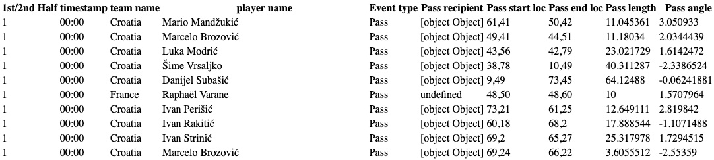

# SoccerHeatTracker

## Background
Welcome to SoccerHeatTracker, an interactive heatmap generator of various data retrieved from professional soccer matches.

Heatmap is a great visualization technique to show the magnitude of aggregations of  data with color intensities. Using sets of tabular data retrieved from a single match, SoccerHeatTracker will visualize different types of players' data such as passes frequencies, shots, or pass/shot accuracies.  

## Functionality
- Drawing a football pitch with d3-soccer and Canvas
- Retrieving and tabulating data of different soccer matches
- Visualizing heatmaps of each type of data

## Wireframes
### Sample heatmap of passes

### Sample tabular data of a single player

Data source: [Statsbomb](https://github.com/statsbomb/open-data/blob/master/doc/Open%20Data%20Matches%20v3.0.0.pdf)

## Technologies, Libraries, APIs
SoccerHeatTracker uses the following technologies:

- [d3-contour](https://github.com/d3/d3-contour) (D3 plugin for heatmap visualization in contours)
- [Canvas API](https://developer.mozilla.org/en-US/docs/Web/API/Canvas_API) (for rendering interactive visuals)
- npm (to manage project dependencies)

