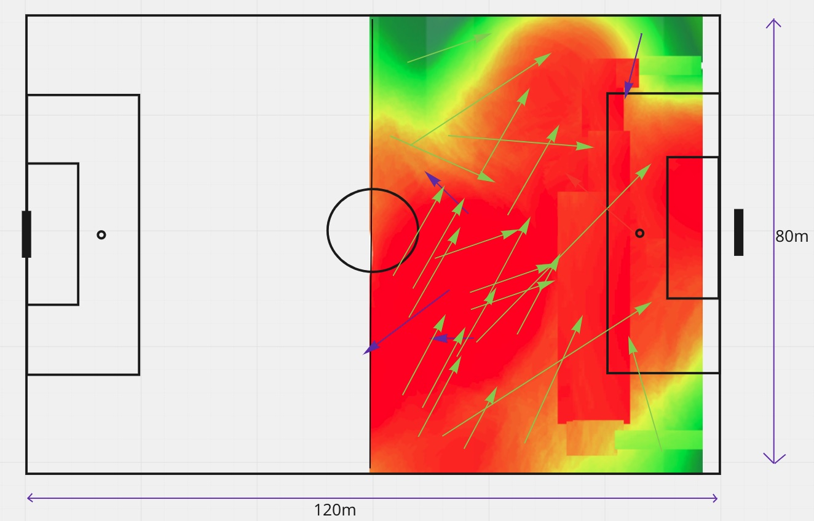

# SoccerHeatTracker

## Background
Welcome to SoccerHeatTracker, an interactive heatmap generator of various data retrieved from professional soccer matches.

## Functionality

## Wireframes

## Technologies, Libraries, APIs
SoccerHeatTracker uses the following technologies:

- d3-soccer (D3 plugin for visualization of soccer data)
- Canvas API (for rendering interactive visuals)
- npm (to manage project dependencies)

